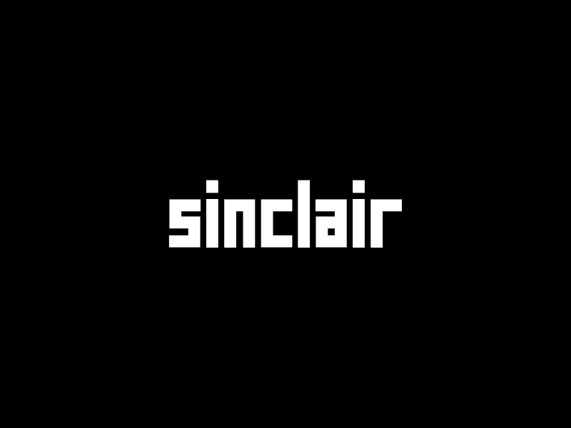
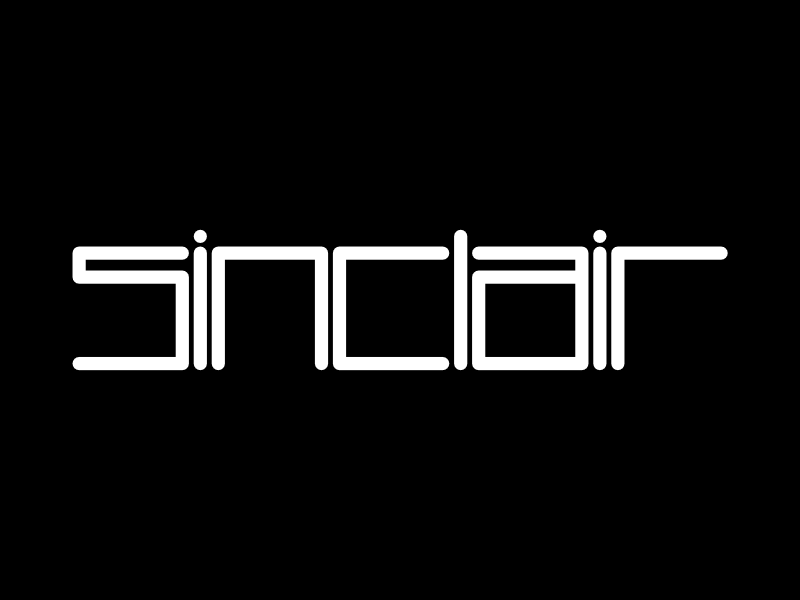
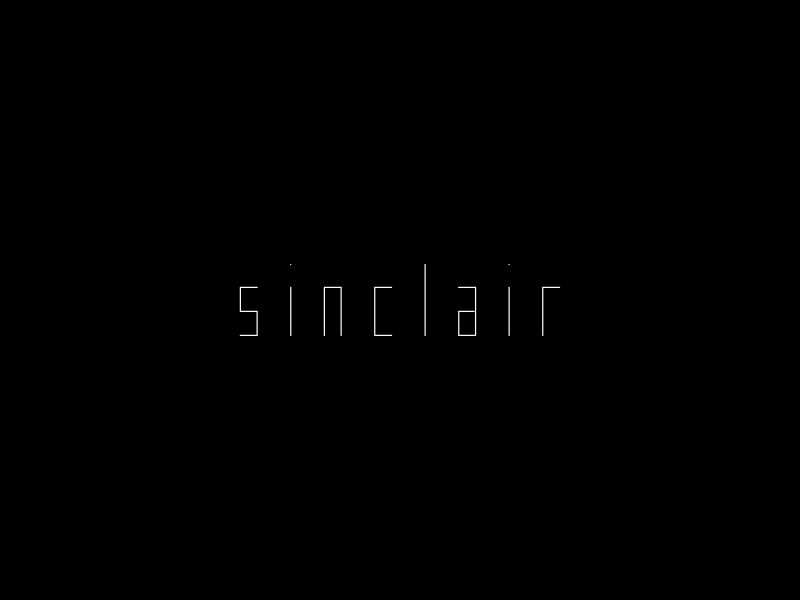

# A Sinclair Logo Toy

The classic Sinclair computer logo is formed on a highly regular grid. Each glyph is defined by intersections of just two vertical and three horizontal grid lines. The constraint is analogous to seven-segment LED displays: a fixed set of possible positions forces each letterform to its most essential shape.

This repository provides an [interactive page](https://dpt.github.io/SinclairLogo/) that parameterises that grid - and the path taken around through it - so you can explore and produce variants of the logo in real time.

---

## Examples

Thick, square-capped strokes at default proportions:

Outlined, rounded, with wider spacing:

Thin outline, minimal spacing:

---

## Running locally

No build step. Open `index.html` directly in a browser.

---

## Controls

**Text** — the string to render. A–Z, 0–9, space, and punctuation; case-insensitive. Unrecognised characters render as a crossed box. Use newlines for multiple lines.

### Horizontal

| Control | Effect |
|---------|--------|
| **Wide character width** | Horizontal span of standard-width glyphs (most letters and digits). |
| **Very wide char factor** | Width of double-wide glyphs (M and W) as a percentage of the base character width. |
| **Spacing** | Gap between glyphs (and between lines). |

### Vertical

| Control | Effect |
|---------|--------|
| **Ascender height** | How far ascenders extend above cap height. Affects B, D, H, K, L, T. Set to 0 to disable the ascender zone entirely. |
| **Upper spacing** | Gap between cap height and the ascender zone. |
| **Upper height** | Height of the upper zone, from mid-point up to cap height. |
| **Bottom height** | Height of the lower zone, from baseline up to the mid-point. |
| **Descender height** | How far descenders extend below the baseline. Affects G, J, P, Q, Y. Set to 0 to disable. |

### Offsets

| Control | Effect |
|---------|--------|
| **Connect** | Internal offset where glyphs connect back to themselves, as a fraction of stroke width. Ranges from 0 to 2× stroke width; default is 0.5×. |
| **Diagonal** | Diagonal offset used in V, X, and Z, as a fraction of stroke width. Ranges from 0 to 2× stroke width; default is 0.5×. |

### Stroke

| Control | Effect |
|---------|--------|
| **Stroke width** | Thickness of each line segment. |
| **Round corners** | Rounds path corners using quadratic curves; slide to control the degree. |
| **Round strokes** | Toggles between round and square stroke caps and joins. |

### Display

| Control | Effect |
|---------|--------|
| **Scale** | Overall size multiplier. |
| **Tile** | Renders lighter copies of the text tiled around the main text, like wallpaper. |
| **Grid** | Overlays the constraint grid: red vertical lines mark x-positions, blue horizontal lines mark y-positions. |
| **Colours** | Selects a foreground/background colour scheme from ten ZX Spectrum palette combinations, or **Manic** — which cycles each glyph through ZX Spectrum colours (red → yellow → green → cyan → blue → magenta) and shifts glyphs up and down. |

### Buttons

| Button | Effect |
|--------|--------|
| **Randomise parameters** | Randomises all controls to produce unexpected results. |
| **Reset** | Restores all controls to their defaults. |
| **Export SVG** | Downloads the current rendering as an SVG file. |

---

## Canvas interaction

The canvas responds to the mouse without clicking any controls:

| Gesture | Effect |
|---------|--------|
| **Hover** | Centres the text on the cursor position. |
| **Drag left/right** | Adjusts stroke width. |
| **Drag up/down** | Adjusts corner rounding. |
| **Scroll wheel** | Adjusts scale. |

---

## Character support

**Original glyphs** — from the logo:

`A` `C` `I` `L` `N` `R` `S`

**Extended glyphs** — invented to complete the alphabet within the same system:

`B` `D` `E` `F` `H` `O` `T` `U` `V` `Z` `0` `1` `2` `3` `4` `5` `6` `7` `8` `9`

**Descending glyphs** — reach below the baseline into the descender zone:

`G` `J` `P` `Q` `Y`

**Characters that bend the rules:**

- `K` — to avoid becoming an H we shift the top right stroke leftwards;
- `M` and `W` — occupy two standard character widths;
- `V` — to distinguish V from U we introduce a diagonal;
- `X` — we again resort to diagonals to create an X;
- `Z` — ditto.

**Punctuation:**

`!` (exclamation mark) `-` (hyphen) `.` (full stop) `|` (vertical bar)

**Special:**

- `` ` `` (Backtick) — renders a special secret logo.

---

## The grid system

Every glyph is drawn using canvas `lineTo` calls that snap to the intersections of a small set of x- and y-coordinates.

**X-axis** — each glyph gets up to three vertical positions:

| Position | Used by                                                    |
|----------|------------------------------------------------------------|
| `x[i]`   | Left edge — all glyphs                                     |
| `x[i+1]` | Right edge — wide glyphs; Centre — double-wide glyphs only |
| `x[i+2]` | Right edge — double-wide glyphs only (M, W)                |

**Y-axis** — six horizontal levels, bottom to top:

| Index | Name | Description |
|-------|------|-------------|
| `y[0]` | Descender bottom | Lowest point; below the baseline |
| `y[1]` | Baseline | Bottom of regular capitals |
| `y[2]` | Mid-lower | Junction between lower and upper zones |
| `y[3]` | Cap height | Top of regular capitals |
| `y[4]` | Ascender gap | Space between cap height and ascender zone |
| `y[5]` | Ascender top | Top of tall letters (B, D, H, K, L, T) |

Enabling the **Grid** toggle draws all active x- and y-lines over the canvas, which makes the system immediately visible.

---

## Licence

[Creative Commons Attribution-ShareAlike 4.0 International (CC BY-SA 4.0)](LICENSE)
